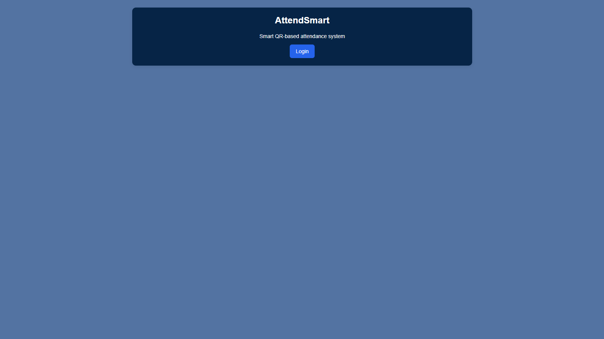
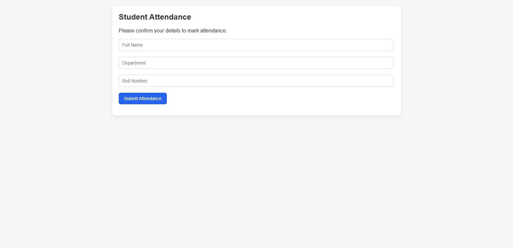
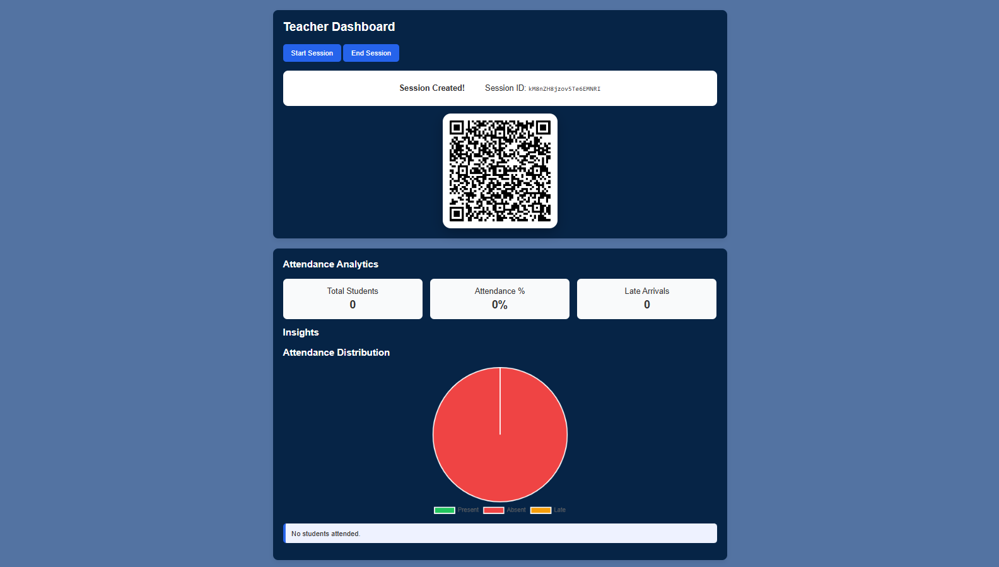

## 🌐 Live Demo
https://attendsmart-fee27.web.app

## 📸 Screenshots

### 🔐 Login Page


### 🧑‍🎓 Student Dashboard


### 📷 Teacher Dashboard



# 📋 AttendSmart

**Smart Student Attendance System using Firebase**

AttendSmart is a modern, web-based student attendance system designed for colleges and universities. It uses **Firebase Authentication**, **Firestore**, and **device camera integration** to make attendance marking fast, secure, and paperless.

---

## 🚩 Problem Statement
Traditional attendance methods are:
- Time-consuming
- Prone to proxy attendance
- Difficult to manage and analyze

AttendSmart solves this by providing a **digital, role-based attendance system** with camera-based verification.

---

## 💡 Solution Overview
AttendSmart provides:
- Secure login for **Students** and **Teachers**
- Camera-based attendance marking (QR / scan-ready design)
- Real-time attendance storage using Firebase
- Simple and clean web interface

---

## ✨ Key Features

### 👨‍🎓 Student
- Login using Firebase Authentication
- Redirected to student dashboard
- Camera interface for attendance marking
- Submit attendance details securely

### 👩‍🏫 Teacher
- Secure login
- View attendance records
- Manage student attendance data

---

## 🛠 Tech Stack

- **Frontend:** HTML, CSS, JavaScript
- **Backend:** Firebase
  - Firebase Authentication
  - Firestore Database
  - Firebase Hosting
- **Version Control:** Git & GitHub

---

## 🔄 How It Works

1. User logs in (Student / Teacher)
2. Role-based redirection
3. Student opens camera interface
4. Attendance data is submitted
5. Data stored securely in Firestore
6. Teacher can view attendance records

---

## 📂 Project Structure

```
AttendSmart/
│── public/
│── server/
│── firebase.json
│── .firebaserc
│── .gitignore
│── login.js
│── 404.html
```

---

## 🚀 Setup Instructions

1. Clone the repository
```bash
git clone https://github.com/aniruddhadari/AttendSmart.git
```

2. Open the project folder
```bash
cd AttendSmart
```

3. Configure Firebase
- Create a Firebase project
- Enable Authentication & Firestore
- Add Firebase config to your JS files

4. Run locally or deploy using Firebase Hosting

---

## 🔮 Future Enhancements
- Face recognition attendance
- Admin dashboard
- Attendance analytics & reports
- Mobile app version

---

## 🏆 Hackathon Note
This project was built as part of a **hackathon** to demonstrate practical use of Firebase for real-world problems in education.

---

## 👤 Author

**Aniruddha Dari**  
GitHub: [@aniruddhadari](https://github.com/aniruddhadari)

---

⭐ If you like this project, don’t forget to star the repository!

